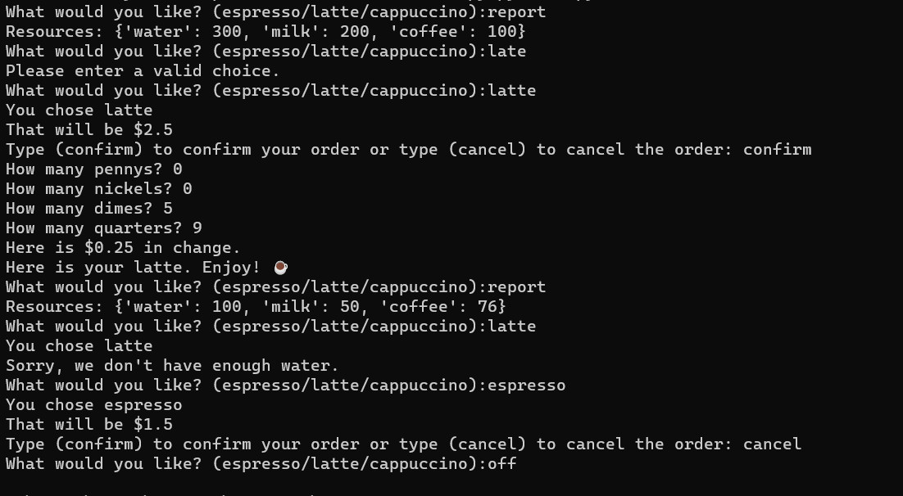

# Coffee Machine Program Using Python

## Description:
### • This program runs on the CLI and provies a logic for a coffee machine that has to manage limited resources (coffee, milk and water), has 3 types of coffee (latte, espresso and cappuccino) and is operated using coins.
### • This program has user input validation so no matter the input you wont crash the program

## Special Commands:
### • "off" - turns off the machine.
### • "report" - gives the current amount of resources remaining



## Installation:
```powershell
git clone https://github.com/ShayCohenn/coffee_machine_python.git
```
```powershell
cd coffee_machine_python
```
```powershell
py main.py
```